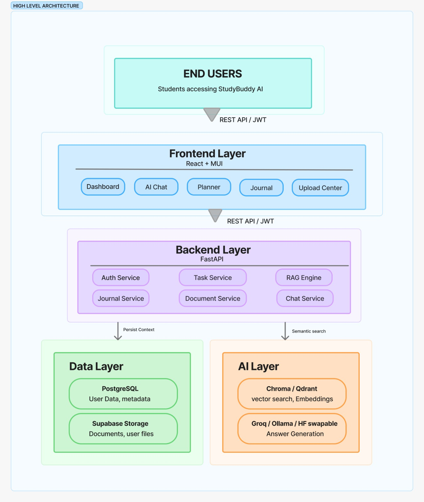
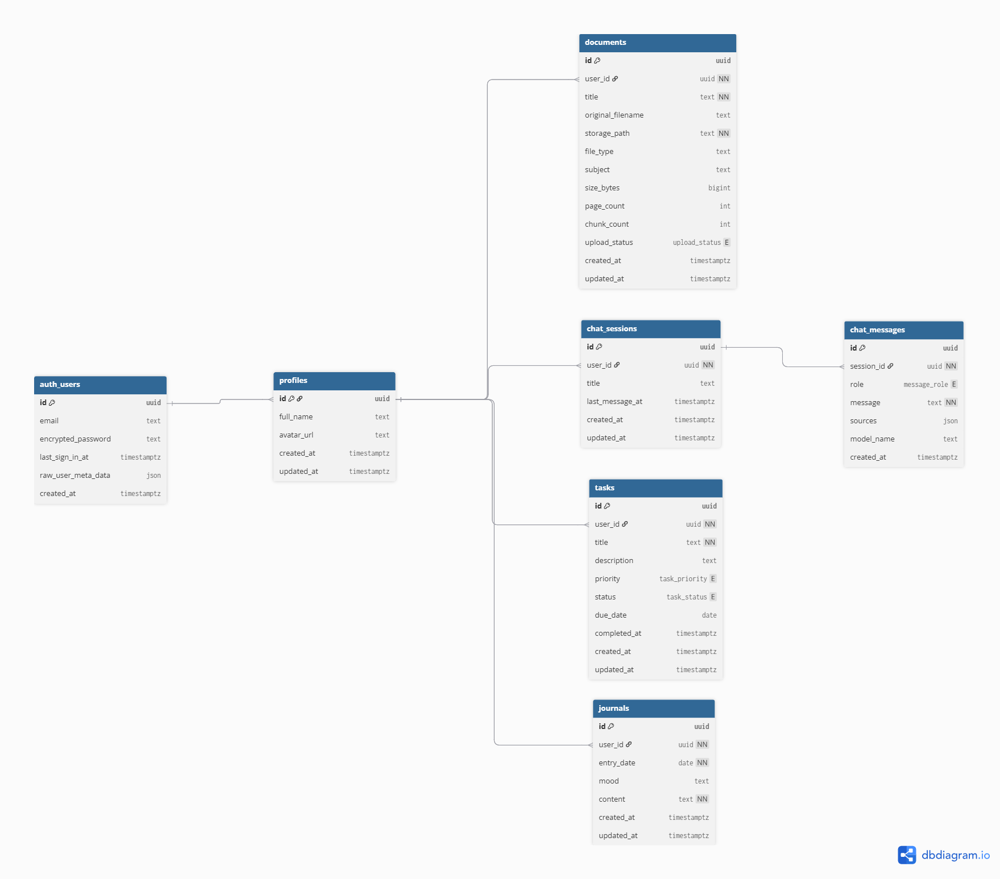

# StudyBuddy AI 📚🤖

> Turn your notes, PDFs, and study materials into an intelligent AI tutor.

StudyBuddy AI is a **Retrieval-Augmented Generation (RAG)** powered learning assistant that helps students learn smarter using their own documents.

Upload notes, textbooks, PDFs, or research materials and ask questions in natural language. Instead of generic responses, StudyBuddy AI retrieves relevant content from your documents and generates accurate, context-aware answers.

Built using a modern full-stack architecture with **FastAPI**, **React**, and AI-powered retrieval pipelines.

---

## 🚀 Why StudyBuddy AI?

Traditional AI chatbots rely on general knowledge and often hallucinate.

StudyBuddy AI is different — it answers **only from your study material**.

- ✔ Personalized learning experience  
- ✔ Accurate, grounded responses  
- ✔ Better revision and exam preparation  
- ✔ Reduced hallucinations  
- ✔ Faster concept understanding  

---

## ✨ Features

- 📄 Upload PDFs, TXT files, and study notes  
- 💬 Ask questions in natural language  
- 🧠 Context-aware AI responses using RAG  
- 🔍 Semantic search with embeddings  
- ⚡ Fast retrieval using vector database  
- 🌐 Full-stack web application  
- 🎯 Clean and responsive UI  
- 🛠️ Modular and scalable backend architecture  

---

## 🧠 How It Works

1. Upload study materials  
2. Extract raw text from documents  
3. Split text into meaningful chunks  
4. Generate embeddings for each chunk  
5. Store embeddings in a vector database  
6. Retrieve relevant chunks for user queries  
7. Generate final response using LLM + context  

---

## 🛠️ Tech Stack

### Frontend
- React  
- Material UI  
- Axios  

### Backend
- FastAPI  
- Python  
- Uvicorn  

### AI / RAG Pipeline
- LangChain  
- ChromaDB (Vector Database)  
- Sentence Transformers  

### Document Processing
- PyMuPDF  

### Dev Tools
- Git & GitHub  
- VS Code  

---

## 📁 Project Structure

```bash
StudyBuddy-AI/
│
├── frontend/
│
├── backend/
│   ├── app/
│   │   ├── routes/
│   │   ├── schemas/
│   │   ├── config/
│   │
│   ├── main.py
│
├── rag_engine/
│   ├── loaders/
│   ├── processing/
│   ├── embeddings/
│   ├── vectorstore/
│   ├── retrieval/
│   ├── prompts/
│   ├── pipeline.py
│
├── data/
├── requirements.txt
└── README.md
````

---

## 🏗️ System Architecture

The system follows a modular RAG-based architecture:

* Frontend (React) handles user interaction and file uploads
* Backend (FastAPI) processes requests and manages APIs
* RAG Engine extracts, embeds, and retrieves context from documents
* ChromaDB stores vector embeddings for semantic search
* LLM generates final responses using retrieved context



---

## 🗄️ Database Design

The database is designed around document-centric retrieval:

* Each document is split into chunks
* Each chunk is converted into embeddings
* Embeddings are stored in ChromaDB with metadata
* Metadata includes document name, chunk index, and source



---

## 📊 Key Design Decisions

* Used **RAG instead of fine-tuning** → faster & scalable
* Chose **ChromaDB** for lightweight vector search
* Modular pipeline design for easy upgrades
* FastAPI for async performance and simplicity

---

## 🚀 Future Improvements

* Multi-user authentication system
* Chat history storage
* Streaming responses
* Support for images + OCR
* Mobile-friendly UI

---

## 📌 Status

🚧 Active development project
🎯 Built for learning + portfolio showcase

---

## 👨‍💻 Author

Built by a passionate AI/ML student exploring real-world LLM applications.

**~varsavarniga**

```
